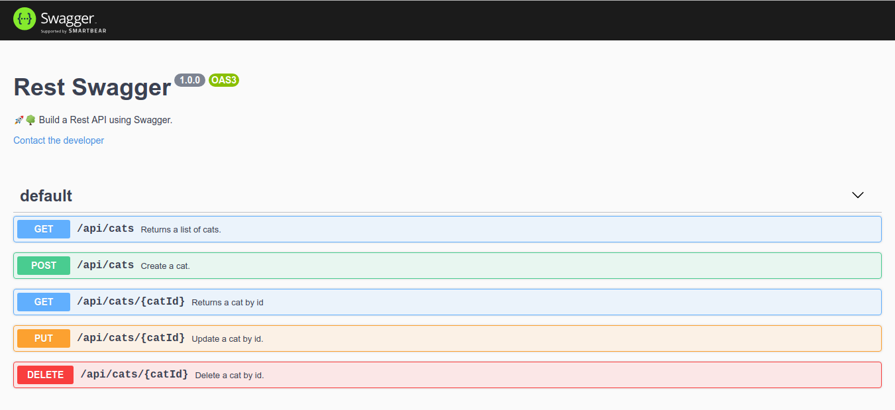

# rest-swagger

> 🚀🌳 Build a Rest API using Swagger.



## Quick start

### Install dependencies

```sh
$ yarn
```

### Run this project

```sh
$ yarn start
```

Go to [here](http://127.0.0.1:9000/docs) to view api documents.

## API

| Route            | HTTP method | Description                 |
|------------------|-------------|-----------------------------|
| /api/cats        | `GET`       | Get all the cats.           |
| /api/cats        | `POST`      | Create a cat.               |
| /api/cats/:catId | `GET`       | Get a single cat.           |
| /api/cats/:catId | `PUT`       | Update a cat with new info. |
| /api/cats/:catId | `DELETE`    | Delete a cat.               |
